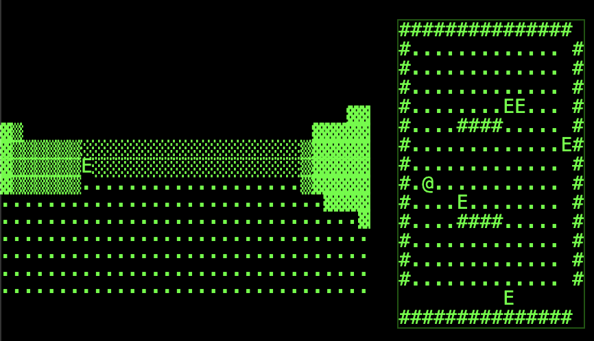

# DuckDB-DOOM

A 3D first-person shooter game implemented entirely in SQL using DuckDB-WASM.



## Overview

DuckDB-DOOM is an experimental game that demonstrates the power of SQL for computational tasks. The entire game logic, including 3D raycasting, enemy AI, collision detection, and rendering is implemented using SQL queries running in DuckDB's WebAssembly build.

## Features

- True first-person 3D rendering using raycasting techniques
- Collision detection
- Enemy NPCs
- Shooting mechanics with bullets
- Minimap display
- All game logic implemented in SQL

## How to Play

1. Open `index.html` in a modern web browser
2. Use WASD keys to move:
   - W: Move forward
   - S: Move backward 
   - A: Turn left
   - D: Turn right
3. Spacebar: Shoot
4. L: Toggle verbose logging (to browser console)

## Technology

This project uses:
- [DuckDB-WASM](https://github.com/duckdb/duckdb-wasm): SQL database that runs in the browser
- Pure HTML/JavaScript for the UI
- SQL for all game mechanics and rendering

## How It Works

The game uses SQL in interesting ways:

1. 3D Rendering: Uses recursive CTEs to implement raycasting
2. Game state: Stored in tables (player, enemies, bullets, map)
3. Physics: SQL queries handle collision detection and movement
4. Rendering: Views transform the 3D world state into ASCII art

## Installation

No installation needed! Just clone the repository and open `index.html` in a web browser:

```bash
git clone https://github.com/yourusername/duckdb-doom.git
cd duckdb-doom
# Open index.html in your browser
```

## Contributing

Contributions are welcome! Some ideas for improvements:

- Add textures to walls
- Implement more complex enemy AI
- Add sound effects
- Create additional levels

## License

MIT License - see [LICENSE](LICENSE) for details.

## Acknowledgments

- Inspired by the original DOOM game
- Thanks to the DuckDB team for their amazing WebAssembly build
